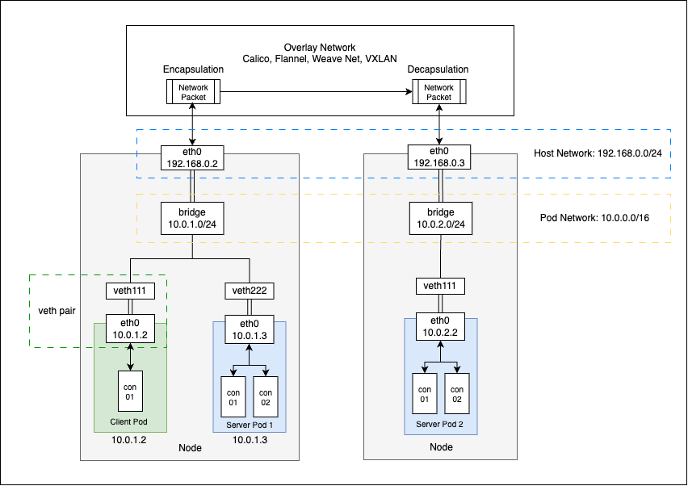
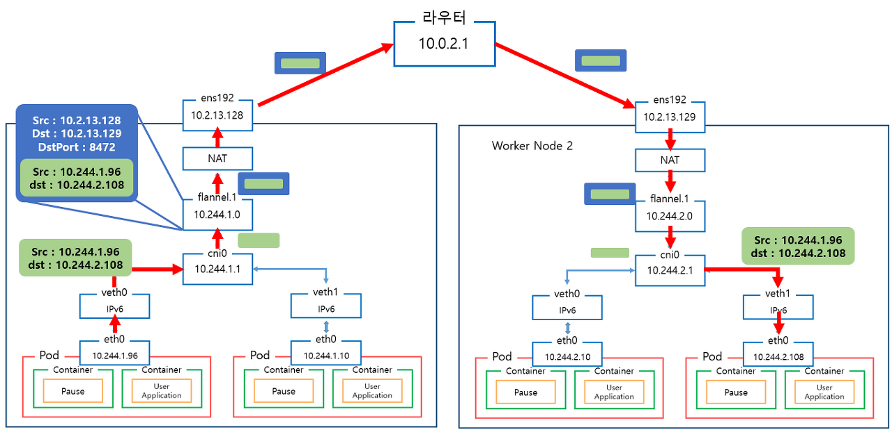
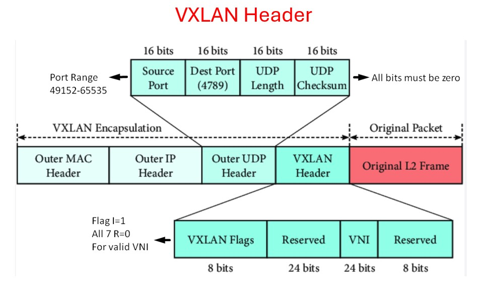
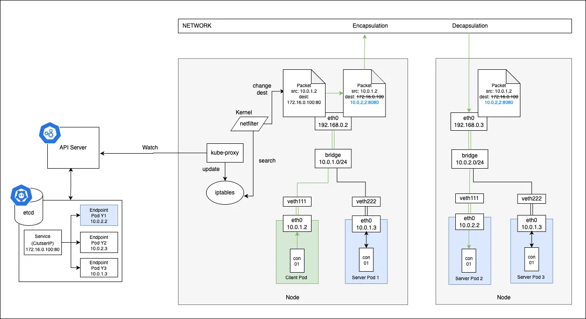

# Kubernetes Network Overview

## Network Model

- 각 파드는 cluster-wide IP 주소를 가짐
- 클러스터 네트워크는 파드의 배포 위치와 관계없이, 그리고 별도의 프록시나 NAT 없이 상호 통신할 수 있음
- Service 는 파드로 향하는 long-lived IP/Hostname을 제공함
- Gateway 혹은 Ingress 는 Serivce가 클러스터 외부에서 접근 가능하도록 함

## Cluster Networking

### Perspectives

1. 동일 파드 내 컨테이너 간 통신
2. 파드 to 파드 통신
3. 파드 to 서비스 통신
4. 외부 to 서비스 통신

### k8s IP Assign

- 파드에 IP 할당 by Network Plugin
- Service에 IP 할당 by kube-apiserver
- 노드에 IP 할당 by kubelet

## Pod to Pod 통신

### Overlay Network

1. 동일 노드 내에 파드 간 통신

   1. 파드는 kubelet에 의해 컨테이너 런타임 통해서 생성
   2. 파드는 컨테이너 런타임이 제공하는 bridge 네트워크와 연결되어 있음
   3. veth Pair라고 불리는 가상 네트워크 인터페이스가 구성되어, 한쪽은 컨테이너 다른 한쪽은 bridge와 연결됨
   4. 따라서 bridge에는 모든 파드의 veth Pair와 연결되어 있음
   5. 이를 통해 동일 노드에서 실행 중이 파드 간 통신에는 NAT 없이 플랫하게 가능

2. 서로 다른 노드에 위치한 파드 간 통신

   1. L2/L3 물리적인 네트워크 장비 위에 논리적으로 가상화된 네트워크 라우팅 경로를 형성

      CNI 플러그인을 통해서 구현됨

   2. 컨테이너 런타임의 bridge는 호스트 노드의 Physical 네트워크 인터페이스와 연결되어 있음

   3. Overlay 네트워크에 의해 패킷이 Encap 및 Decap 되어 전달됨

### CNI 플러그인

- Flannel

  

- Calico

  

- Cilium

### Encapsulation

- VXLAN

  

- IPIP

### Packet Handling

- netfilter + iptables
- eBPF

## Pod to Service 통신

### kube-proxy

