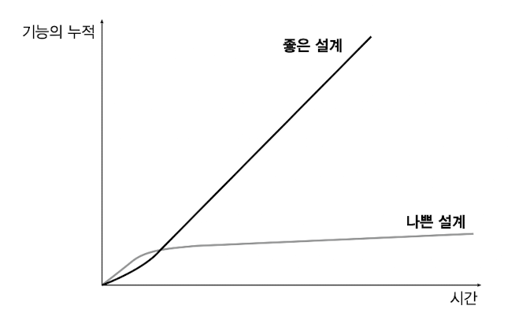
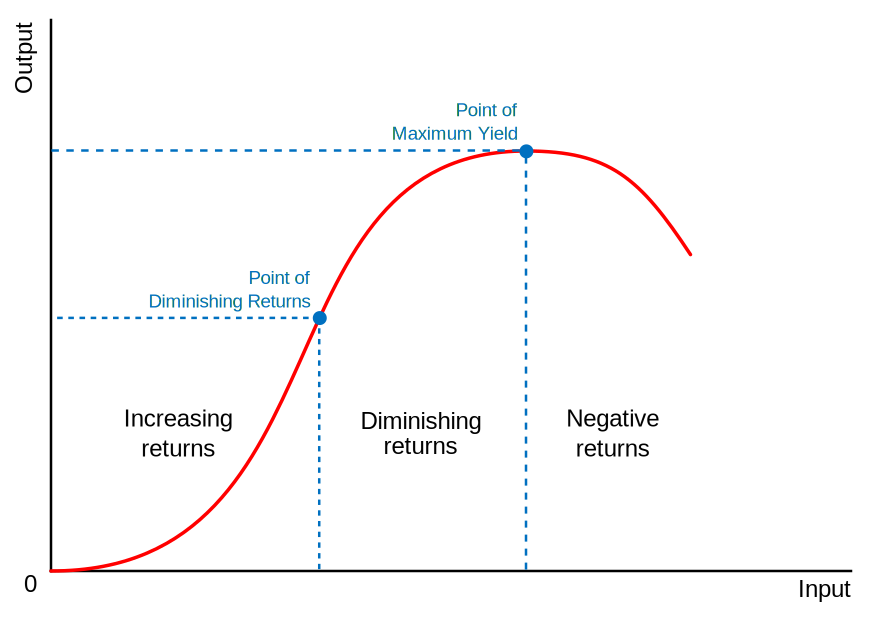
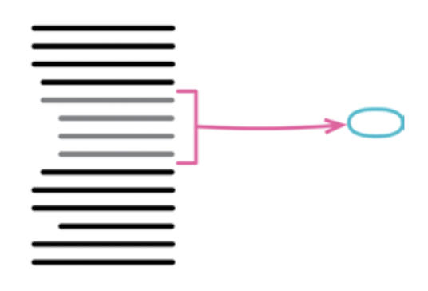
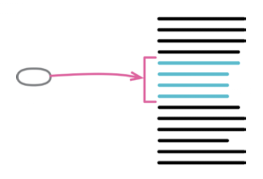
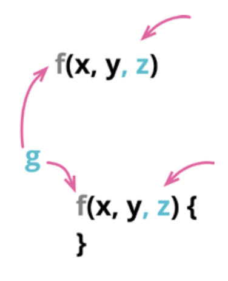
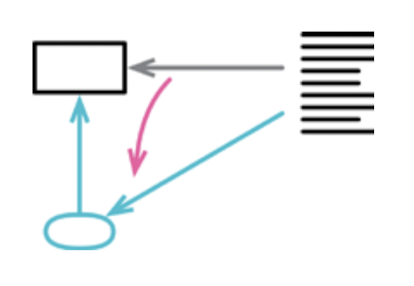
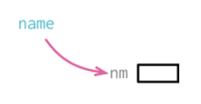
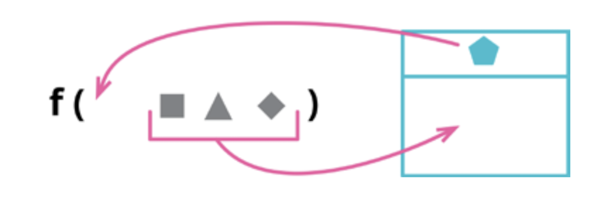
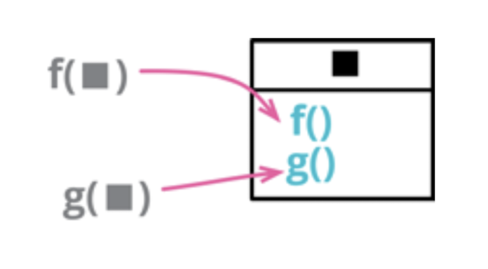
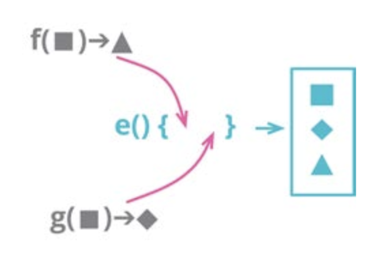

## 들어가며

>  리팩터링은 겉으로 드러나는 코드의 기능은 바꾸지 않으면서 내부 구조를 개선하는 방식으로 소프트웨어 시스템을 수정하는 과정이다. 요컨대, 리팩터링한다는 것은 코드를 작성하고 난 뒤에 설계를 개선하는 일이다.
>
>  시간이 흐르면서 코드는 수정되고 시스템의 무결성, 즉 설계에 맞춘 구조는 점차 뒤죽박죽이 되어간다.
>
>  처음부터 완벽한 설계를 갖추기보다는 개발을 진행하면서 지속적으로 설계한다.

## Chapter 01. 리팩터링: 첫번째 예시

> 새로운 기능을 추가하기에 편한 구조가 아니라면, 먼저 기능을 추가하기 쉬운 형태로 리팩터링하고 나서 원하는 기능을 추가한다.

> 리팩터링의 첫 단계는 항상 똑같다. 리팩터링할 코드 영역을 꼼꼼하게 검사해줄 테스트 코드들부터 마련해야 한다.

> 리팩터링이 성능에 상당한 영향을 주기도 한다. 그런 경우라도 개의치 않고 리팩터링한다. 잘 다듬어진 코드라야 성능 개선 작업도 훨씬 수월하기 때문이다. 리팩터링 과정에서 성능이 크게 떨어졌다면 리팩터링 후 시간을 내어 성능을 개선한다.
>
> 리팩터링으로 인한 성능 문제에 대한 조언은 '특별한 경우가 아니라면 일단 무시하라'는 것이다.

- 항상 "컴파일-테스트-커밋" 과정을 강조하는데, 테스트 코드가 항상 완전하다는 가정인걸까?
  - `statement` 뽑아내는 로직에서 보여주는 형식이 문자열 뿐에서 HTML도 추가하고 싶다는 요구사항이 있을 때,
  - 그 요구사항을 위한 기능 구현시 기대되는 테스트 코드가 온전해야 (== 결함이 없어야) 본문의 리팩터링이 유효한걸까

- 본문에서 말하는 리팩터링 기법을 가리키는게 너무 장황(?)하다 (책이라서 더 그런듯)
  - 함수 추출하기, 조건부 로직을 다형성으로 바꾸기, .. 등등
  - [리팩터링 GURU](https://refactoring.guru/ko/refactoring)에 나오는 내용도 (중복이지만) 직관적이어서 같이 보면 좋을것 같다

## Chapter 02. 리팩터링 원칙

### 리팩터링의 뜻은,

- 명사) 소프트웨어의 겉보기 동작은 그대로 유지한 채, 코드를 이해하고 수정하기 쉽도록 내부 구조를 변경하는 기법
- 동사) 소프트웨어의 겉보기 동작은 그대로 유지한 채, 여러 가지 리팩터링 기법을 적용해서 소프트웨어를 재구성하다
  - 디자인 패턴 일부가 속할 수 있다

> 누군가 "리팩터링하다가 코드가 깨져서 며칠이나 고생했다"라고 한다면, 십중팔구 리팩터링한 것이 아니다
>
> O-<--< (..찔림)

### '재구성'과 '리팩터링' 용어는 구분할 필요가 있다

- 코드베이스를 정리하거나 구조를 바꾸는 모든 작업을 '재구성'이라는 포괄적인 용어로
- '리팩터링'은 재구성 중 특수한 한 형태로
- 어쩌면 디자인 패턴을 적용하는 작업도 리팩터링일 수 있겠다

### 리팩터링하면 코드 개발 속도를 높일 수 있다



- 리퍽터링은 코드 품질을 높인다는 점에는 쉽게 수긍, 하지만 그만큼 시간이 드니 전체 개발 속도는 떨어질 것 같다고도 생각
- 초기 진척이 빠르다고 느낄 수 있지만, 새로운 기능을 추가할수록 기존 코드베이스에 잘 녹여낼 방법을 찾아야 하기에 속도는 느려지고 버그 해결하는 시간은 한층 더 걸린다
- 사실 (긍정적 경험이 없는) 현재로서는 이론적인 좋은 말.. 정도로 느껴지기도 한다. 한번은 다른 경험자의 주도로 직접 느껴봐야 향후 자연스레 실천으로 이어질거 같다
  - Q. 경험하신 분 계신가요~

### 리팩터링은 언제 해야할까

- 별도로 시간과 일정을 빼서 하려하지 말자
- 계획된 리팩터링과 수시로 하는 리팩터링으로
- 코드베이스에 기능을 새로 추가하기 전, 코드를 수정하기 전
- 추가 유닛 테스트를 작성하기 (개발물의 구조상 이유로) 어려울 때

### 코드 리뷰에 리팩터링

- 커밋 단위로 코드 변경 사항에 대한 목적이 한가지이어야 한다
- PR에는 `refactor` 커밋과 `feat` 커밋이 같이 존재할 수 있다

### 리팩터링은 클린코드나 바람직한 엔지니어링 습관처럼 정당화하면 안된다

- 리팩터링의 본질은 오로지 경제적인 이유로 행하는 것이다
- 기능 추가 시간을 줄이고, 버그 수정 시간을 줄여준다
- 코드베이스를 예쁘게 꾸미는 데 있지 않음을 명시해야 한다
- 리팩터링의 ROI(Return on Investment)는 생산성 증대

### 레거시 코드에서의 리팩터링

- 첫 파악을 할 때 리팩터링 (동사) 하는게 큰 도움이 된다
- 동시에 당연히 테스트 보강이 되어야 명료하게 리팩터링할 수 있다
- 쉽게 해결할 방법은 없다 (처음부터 테스트 코드를 작성해야 하는 이유이다)

> 코딩 전에 아키텍처를 확정지으려 할 때의 대표적인 문제는 소프트웨어 요구사항을 사전에 모두 파악해야 한다는 것이다. 하지만 막상 해보면 실현할 수 없는 목표일 때가 많다.

### 현재의 요구사항과 미래의 사항들을 예측해 코드로 표현하는 것은 불가능함을 인지하자

- 현재까지 파악한 요구사항만을 해결하는 소프트웨어를 구축한다
- 문제를 더 깊이 이해하게 된 나중에 처리하는 쪽이 훨씬 낫다
- 소프트웨어의 복잡도를 높일 수 있는 메커니즘은 반드시 검증을 거친 후에 추가한다
- YAGNI (you aren't going to need it) 설계 방식

### 리팩터링을 녹여낸 개발 프로세스

- 핵심 요소는 유닛 테스트 코드이다
- 지속적 통합/배포로 위험요소를 줄이며 공유하자

## Chapter 03. 코드에서 나는 악취

### 언제 해야하는가에 대한 딜레마

- 리팩터링 기법을 설명하는건 쉽지만, '언제' 해야 효과적인지에 대해서는 정립된 규칙이 없다
- 프로그래밍 미학 / 경험에 기반한 등 모호한 개념보다는 코드에서 냄새가 날 때 ! - 즉, 문제의 징후가 감지될 때를 기준으로
  - 그럼에도 숙련된 사람의 직관이 가장 신뢰할만한 판단 기준이다

### 악취 (Smell) 란?

- 리팩터링이 필요한 시그널
- 반드시 문제 (== 버그) 는 아니지만, 잠재적 구조적 문제를 암시
- 코드를 보고 '뭔가 이상하다…' 싶다면, 이미 냄새가 나는 것이다
- 악취를 맡을 수 있는 감각은 경험으로 길러지는 기술
- 모든 냄새를 즉시 없애야 한다는 건 아님
  - 냄새는 나쁜 게 아니라, 리팩터링이 필요한 구역을 알려주는 센서 정도로 생각하자.

### 코드 냄새들

- 기이한 이름

  - `processData()` 같은 이름 - 이름만 봐서는 무슨 일을 하는지 모름

  - 이름 잘 짓기는 항상 어렵다

  - 구현하다보면 명확해지는 경우도 종종 있다

    일단 그럴싸하지 않은 이름으로 대충 지어놓고, 나중 가서 IDE 리팩터링 기능으로 바꿔보는 방향 !

- 중복 코드

  - 복붙 -> 변수 값 살짝 바꾸는 패턴
  - 개인적으로 중복이 발생하기 전부터 예상되는 중복을 줄이기 위해서 돌아돌아 간다는 느낌을 받는 경우가 꽤 많다
  - 세번째 중복부터 리팩터링의 효능이 있지 않을까하는 개인적인 기준

- 긴 함수 / 긴 매개변수 목록

  - 너무 많은 책임을 갖고 있다는 반증
  - 종종 오픈소스 라이브러리 코드보다가 이리저리 함수 이동하면서 보는게 복잡했던 경우도 많았다

- 전역 데이터

  - 상대적으로 다른 냄새보다 전역으로 무언가를 하는게 거의 등장하지 않았던 것 같다

    1학년때 C언어 배울때부터 전역변수 쓰지말라고 귀 따갑게 들어서 그런가

  - 싱글톤 패턴에서는 여전히 오남용하지 않도록 주의 !

- 가변 데이터

  - 접근자를 제어 (캡슐화)
  - Rust 에서는 변수에 대한 메모리 접근 권한도 제어할 수 있다

- 뒤엉킨 변경

  > 하나의 모듈이 서로 다른 이유들로 인해 여러가지 방식으로 변경되는 일

  - SRP가 깨진 모습

- 반복문

  - 반복문을 파이프라인으로 바꾸기
  - `let mids = messages.into_iter().map(|m| m.id)`

- 추측성 일반화

  > 미래를 대비해 작성한 부분은 실제로 사용하게 되면 다행이지만, 그렇지 않는다면 쓸데없는 낭비일 뿐이다. 당장 걸리적거리는 코드는 눈앞에서 치워버리자.

- 주석

  > 주석은 악취가 아닌 향기를 입힌다. 문제는 주석을 탈취제처럼 사용하는 데 있다.

## Chapter 04. 테스트 구축하기

### 자가 테스트 코드의 가치

- 모든 테스트는 자동화, 즉 결과까지 스스로 검사하도록
- (견고한 테스트 케이스들이라면) 버그 발생 지점을 빠르게 찾을 수 있다
- 동작이 빠르고 결정적 (재현 가능성) 이어야 한다
  - 무거운 모듈이 있다면 Stub / Fake 구현이 필요

- 테스트를 작성하기 가장 좋은 시점은 프로그래밍을 시작하기 전 (== TDD)
  - Q) 도메인 혹은 언어(라이브러리), 둘 중 하나라도 능통하지 않음에도 가능할까?

### 테스트 작성하기

- (1) 픽스처 설정, (2) 검증
  - given-when-then 패턴
  - teardown/cleanup 단계도 (드물게) 명시적으로 수행해야할 때가 있다 - 비싼 자원인 픽스처같은 경우
- 단순히 필드를 읽고 쓰기만 하는 접근자는 테스트할 필요가 없다
- 테스트끼리 상호작용하게 하는 공유 픽스처 생성은 피해야 한다

### 경계 조건 검사하기

- 해피 케이스를 벗어나는 경계 지점에 대한 문제 검증

- 테스트 작성 수준에도 적절함이 중요하다 (Law of Diminishing Returns)

  위엄한 부분 (i.e.경계 조건) 에 집중하는게 좋다

  

- 유닛 테스트 코드의 목적은 결함을 발견할 수 있다는 믿음을 갖게 해주는 것이다 (주관적)

  - 대규모 리팩터링 후에 전체 테스크 케이스 초록불이 들어오면, 그 자체로 리팩터링을 무사히 마쳤다고 느낄 수 있겠는가에 대한 기준

## Chapter 05. 리팩터링 카탈로그 보는 법

생략

## Chapter 06. 기본적인 리팩터링

### 함수 추출하기



- 언제 함수로 묶어야할까?
  - 길이가 길어지면 / 재사용 가능하도록 / .. 등등 다양한 이유가 있을 수 있다
  - 무엇보다 목적과 구현을 분리하는게 중요하다 -> 함수 이름을 보고 목적 (하는 일) 을 파악할 수 있어야 하고, 그 일을 어떻게 하느냐에 영향받지 않도록
- 함수가 하는 일에 맞게 이름을 잘 지어보자
  - '어떻게'가 아닌 '무엇을 하는지'가 드러나야 한다
- 함수로 추출할때 사용하는 변수는..
  - 읽기만 한다면 함수 인수로 전달하자
  - 수정된다면 변수 값 대입 로직을 질의 함수로 추출한다

### 함수 인라인하기



- 함수 본문이 이름보다도 명확한 경우

### 변수 추출하기


- 복잡한 로직을 코드 읽는이 (본인 포함) 가 이해하기 쉽도록
- 추출하는 문맥에 따라,
  - 현재 함수 안에서만 영향력이 있다면 변수로 추출
  - 함수를 벗어난 문맥에서도 의미가 있다면 함수/객체 메세드로 추출

### 변수 인라인하기


- 이름이 변수 표현식과 다를 바 없는 경우

### 함수 선언 (시그니처) 바꾸기



> 위 그림 무슨 의미일까요?

- 함수 선언은 프로그램의 각 부분이 서로 맞물리는 방식 (인터페이스) 을 표현한다
  - 함수 이름은 구현을 보지 않고도 무슨 일을 하는지 파악할 수 있다
  - 함수 매개변수는 외부와 어우러지는 방식을 정의한다
  - 맞물림을 표현하는게 어떤게 더 나은지에 대한 정답은 없다

### 변수 캡슐화하기



- 호출부가 많은 데이터 관리 포인트를 하나로 (데이터 접근을 독점하도록) 캡슐화한다
  - Getter / Setter
- 데이터 구조의 참조 뿐만 아니라 필드 값을 변경하는 행위도 제어해야 한다
  - Getter가 데이터의 복제본을 반환하도록 -> 원본 객체 값과 관련이 없게 됨

```rust
#[derive(Serialize, Deserialize, Clone, Debug)]
pub struct EnvelopeMessage<P: Clone + Debug = serde_json::Value> {
    // ..
    timestamp: DateTime<Utc>,
    payload: P,
}

impl<P> EnvelopeMessage<P>
where
    P: Clone + Debug,
{
    // ..

    pub fn payload(&self) -> &P {
        &self.payload
    }
    
    pub fn payload_cloned(&self) -> P {
    	self.payload.clone()
	}
    
    // ANTI_PATTERN: what if `payload` field able to changed using getter method?
	//    let mut payload = msg.payload_mut()
	//    payload.foo = bar
    pub fn payload_mut(&mut self) -> &mut P {
    	&mut self.payload
	}
}
```

- 참조 반환이 더 적절한 경우
  - 데이터를 읽기 전용으로 잠깐 사용할 때
  - 값이 큰 (복잡한) 데이터라 복제 비용이 꽤 클것으로 예상될 때
  - 호출부에서 필드에 대한 참조를 오래 갖고 있으면 Borrow 길어져서 같은 객체에 대해 접근이 제한됨
- 복제 반환이 더 적합한 경우
  - 반환값을 오래 보관할 때
  - 타입이 작거나 복제 비용이 미미한 경우
  - 스레드 경계를 넘어 소유권 이동이 필요한 경우


### 변수 이름 바꾸기



- 생략

### 매개변수 객체 만들기



- 데이터 뭉치를 데이터 구조로 묶으면 관계가 명확해진다
- 공유하는 문맥이 만들어지면, 메서드로 표현할 수 있는 동작이 많아진다
  - 문맥을 표현하는 추상화 개념으로 격상될 수 있다


### 여러 함수를 클래스로 묶기



- 데이터를 공유하는 함수를 클래스로 묶으면 이들이 공유하는 공통 환경을 명확히 표현할 수 있다
  - 함수 파라미터가 줄어서 간결해지는건 덤
  
- 중첩 함수보다는 클래스로 묶는게 보통 선호되는 방식
  - 테스트 용이성, 함수 Public 제어자 정의

### 여러 함수를 변


